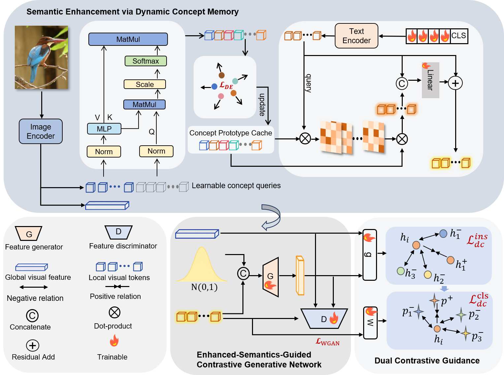

[Semantic Enhancement and Contrastive Generation for Robust Generative Zero-Shot Learning](), 2026

## Overview



## Prerequisites

+ Python==3.11
+ ftfy==6.1.1
+ easydict==1.10
+ numpy==1.24.3
+ pandas==1.5.3
+ Pillow==9.3.0
+ PyYAML==6.0
+ regex==2023.5.5
+ scikit_learn==1.2.2
+ scipy==1.10.1
+ torch==2.5.1
+ torchvision==0.20.1
+ torchaudio==2.5.1
+ tqdm
+ matplotlib
+ opencv-python
+ h5py
+ requests
+ setuptools==68.2.2

## Installation

The model is built in PyTorch 2.5.1 and tested on Linux environment with Python 3.11.

For installing, follow these instructions:

```
conda create -n DCMGAN python=3.11
conda activate DCMGAN
pip install torch==2.5.1 torchvision==0.20.1 torchaudio==2.5.1
pip install -r requirements.txt
```

If `pkg_resources` is missing when importing CLIP, run:

```
pip install setuptools==68.2.2 --force-reinstall
```

### Datasets of GZSL

We conduct experiments on CUB, AWA2, SUN and FLO.

You can download the original ZSL features and splits from the link provided by the TF-VAEGAN authors.

```
link: https://drive.google.com/drive/folders/16Xk1eFSWjQTtuQivTogMmvL3P6F_084u?usp=sharing
```

Extract the dataset files and put them in the datasets folder.

The original feature files usually include `res101.mat` and `att_splits.mat`. In this repository, CLIP-based visual and semantic features are used instead. Run the feature preparation script to construct the required CLIP feature files:

```
cd DCM-GAN
python splits/extract_clip_feature.py
```

This step converts the original ResNet-101 visual features and attribute-based semantic splits into CLIP-based representations:

```
res101.mat       ---> ViTB16.mat
att_splits.mat   ---> clip_splits.mat
```

The expected dataset structure is:

```
datasets/
├── CUB/
│   ├── ViTB16.mat
│   ├── clip_splits.mat
│   └── dcm-clip_splits.mat
├── AWA2/
│   ├── ViTB16.mat
│   ├── clip_splits.mat
│   └── dcm-clip_splits.mat
├── SUN/
│   ├── ViTB16.mat
│   ├── clip_splits.mat
│   └── dcm-clip_splits.mat
└── FLO/
    ├── ViTB16.mat
    ├── clip_splits.mat
    └── dcm-clip_splits.mat
```

`ViTB16.mat` contains the CLIP ViT-B/16 image features, and `clip_splits.mat` contains the class split and the CLIP class-name semantic features.

### Experiments

1. Dynamic Concept Memory-based semantic enhancement.

```
cd DCM-GAN/pt
python train_dcm.py --config configs/GZSL/CUB.yaml
python train_dcm.py --config configs/GZSL/AWA2.yaml
python train_dcm.py --config configs/GZSL/SUN.yaml
python train_dcm.py --config configs/GZSL/FLO.yaml
```

After this stage, the enhanced semantic features will be saved as:

```
dcm-clip_splits.mat
```

2. Contrastive generative training for generalized zero-shot learning.

```
cd DCM-GAN/tfvaegan
python scripts/run_CUB.py
python scripts/run_AWA2.py
python scripts/run_SUN.py
python scripts/run_FLO.py
```

The second stage uses the enhanced semantic features by setting:

```
--class_embedding dcm-clip
```

## Results

The following results are obtained by DCM-GAN. `Acc` denotes conventional zero-shot learning accuracy, and `U`, `S`, and `H` denote unseen accuracy, seen accuracy, and harmonic mean under the generalized zero-shot learning setting.

| Dataset | CZSL Acc | GZSL U | GZSL S | GZSL H |
|---|---:|---:|---:|---:|
| AWA2 | 98.9 | 93.0 | 94.4 | 93.7 |
| SUN | 89.4 | 74.3 | 64.4 | 69.0 |
| CUB | 76.0 | 64.5 | 74.5 | 69.1 |
| FLO | 84.4 | 76.8 | 92.7 | 84.0 |


## Citation

If you find this useful, please cite our work as follows:

```
@article{dcmgan,
  title={Semantic Enhancement and Contrastive Generation for Robust Generative Zero-Shot Learning},
  author={Xiaoqin Lin, Dian Yu, Min Meng and Jigang Wu},
  journal={TVC},
  year={2026}
}
```
## References

We thank the following repos for providing helpful components in our work:

- [DFZSL](https://github.com/ylong4/DFZSL)
- [TF-VAEGAN](https://github.com/akshitac8/tfvaegan)
- [CLIP](https://github.com/openai/CLIP)
